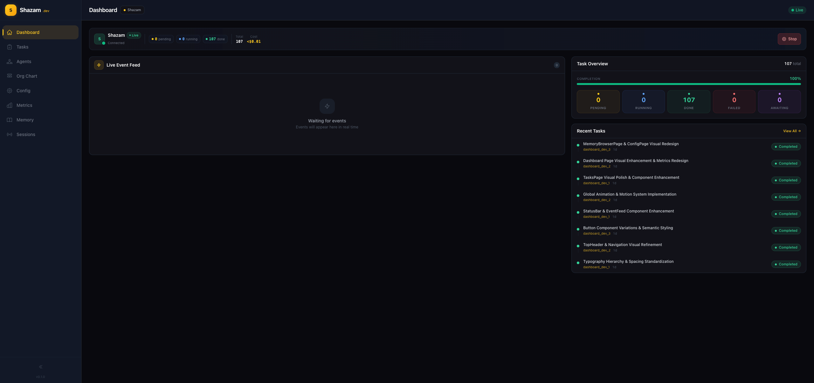

<p align="center">
  
</p>

<h1 align="center">Shazam Dashboard</h1>

<p align="center">
  Real-time AI agent management interface built with Vue 3, TypeScript, and Tailwind CSS.
</p>

<p align="center">
  
  
  
  
  
</p>

---

## Overview

Shazam Dashboard is the command center for the Shazam AI multi-agent framework. It provides a real-time view into autonomous software development workflows — monitoring agents, tasks, sessions, and organizational structure through a polished, responsive interface.

The dashboard connects to the Shazam backend via WebSocket for live event streaming and REST APIs for data management, giving teams full visibility into their AI agent operations.

---

## Features

### Design System v2.0
- Golden-amber brand palette with 10 shades (50-950)
- Programmatic design tokens for consistent theming
- Layered surface elevation system (5 levels)
- Glassmorphism navigation with backdrop-blur effects
- Typography system: Inter (body) + JetBrains Mono (code)

### Animation & Motion
- 11 Vue transitions (`v-fade`, `v-fade-up`, `v-scale`, `v-modal`, `v-notification`, and more)
- 7 motion composables (`useStaggeredEntrance`, `useCountUp`, `useInView`, etc.)
- Custom easing functions (`ease-bounce-in`, `ease-bounce-out`)
- Full `prefers-reduced-motion` accessibility support in both CSS and JS

### Real-Time Updates
- WebSocket event streaming with auto-reconnect
- Live cost tracking and event feed
- Debounced task refresh to prevent API hammering
- Connection status indicator

### Responsive Design
- Mobile-first breakpoints (`sm`, `md`, `lg`)
- Touch-friendly targets (44px minimum)
- Progressive spacing and text scaling
- Hamburger menu with animated mobile sidebar

### 8 Pages
- **Dashboard** — Task overview, cost tracking, recent activity
- **Agents** — Agent cards with status, model, token usage
- **Tasks** — Table with create form, detail panel, filtering
- **Org Chart** — Hierarchical tree with responsive scaling
- **Sessions** — Real-time session monitoring
- **Metrics** — Statistics and aggregation
- **Memory Browser** — Tree-based memory navigation
- **Config** — Tabbed settings (General, Agents, Plugins, Ralph, TechStack, Workspaces)

---

## Tech Stack

| Technology | Version | Purpose |
|------------|---------|---------|
| [Vue 3](https://vuejs.org/) | 3.5+ | UI framework (Composition API + `<script setup>`) |
| [TypeScript](https://www.typescriptlang.org/) | 5+ | Type safety (strict mode, zero errors) |
| [Tailwind CSS](https://tailwindcss.com/) | 3+ | Utility-first styling |
| [Vite](https://vite.dev/) | 6+ | Build tool and dev server |
| [Pinia](https://pinia.vuejs.org/) | 3+ | State management |
| [Vue Router](https://router.vuejs.org/) | 4+ | Client-side routing with code splitting |

---

## Quick Start

```bash
# Install dependencies
npm install

# Start development server
npm run dev

# Build for production
npm run build

# Preview production build
npm run preview
```

The dev server starts at `http://localhost:5173` with hot module replacement enabled.

---

## Installation

### Prerequisites

- **Node.js** 18+
- **npm** 9+

### Setup

1. Clone the repository:
```bash
git clone <repository-url>
cd shazam-dashboard
```

2. Install dependencies:
```bash
npm install
```

3. Start the development server:
```bash
npm run dev
```

The Vite dev server proxies API requests to the Shazam backend. Ensure the backend is running for full functionality.

---

## Development

### Scripts

| Command | Description |
|---------|-------------|
| `npm run dev` | Start dev server with HMR at `localhost:5173` |
| `npm run build` | Type-check with `vue-tsc` then build for production |
| `npm run preview` | Preview the production build locally |

### Type Checking

TypeScript strict mode is enforced. The build command runs `vue-tsc` before bundling:

```bash
npm run build
```

### API Proxy

The Vite dev server proxies `/api/*` requests to the backend. Configure the backend URL in `vite.config.ts`.

---

## Build & Performance

Production builds are code-split per page via Vue Router lazy loading.

```bash
npm run build
# Typical output: built in ~1 second
```

### Bundle Sizes (gzipped)

| Chunk | Size |
|-------|------|
| Main index | 49.82 kB |
| TasksPage | 10.32 kB |
| DashboardPage | 10.31 kB |
| ConfigPage | 9.51 kB |
| AgentsPage | 8.52 kB |
| OrgChartPage | 4.89 kB |
| MemoryBrowserPage | 4.28 kB |
| SessionsPage | 4.16 kB |
| MetricsPage | 3.80 kB |

All page chunks are under 11 kB gzipped. Total CSS: 11.86 kB gzipped.

---

## Project Structure

```
shazam-dashboard/
├── public/
│   └── shazam_dash.png          # Dashboard screenshot
├── src/
│   ├── api/                     # Service layer (HTTP client + API services)
│   │   ├── http.ts              # HTTP client with extractKey response parsing
│   │   ├── agentService.ts
│   │   ├── companyService.ts
│   │   ├── configService.ts
│   │   ├── eventService.ts
│   │   ├── memoryService.ts
│   │   ├── metricsService.ts
│   │   └── taskService.ts
│   ├── components/
│   │   ├── common/              # Reusable UI components (8)
│   │   │   ├── Button.vue
│   │   │   ├── ConnectionIndicator.vue
│   │   │   ├── EmptyState.vue
│   │   │   ├── ErrorBoundary.vue
│   │   │   ├── LoadingSpinner.vue
│   │   │   ├── Pagination.vue
│   │   │   ├── StatusBadge.vue
│   │   │   └── ToastContainer.vue
│   │   ├── features/            # Feature-specific components (18)
│   │   │   ├── AgentCard.vue
│   │   │   ├── AgentList.vue
│   │   │   ├── EventFeed.vue
│   │   │   ├── OrgTreeNode.vue
│   │   │   ├── TaskTable.vue
│   │   │   ├── Config*Tab.vue   # 6 config tab components
│   │   │   └── ...
│   │   └── layouts/             # Layout components (4)
│   │       ├── AppLayout.vue
│   │       ├── TopHeader.vue
│   │       ├── SidebarNav.vue
│   │       └── MobileSidebar.vue
│   ├── composables/             # Vue 3 composables (18)
│   │   ├── useActiveCompany.ts
│   │   ├── useMotion.ts         # Animation & motion system
│   │   ├── useWebSocket.ts      # Real-time event streaming
│   │   └── ...
│   ├── pages/                   # Route-level page components (8)
│   │   ├── DashboardPage.vue
│   │   ├── AgentsPage.vue
│   │   ├── TasksPage.vue
│   │   ├── OrgChartPage.vue
│   │   ├── SessionsPage.vue
│   │   ├── MetricsPage.vue
│   │   ├── MemoryBrowserPage.vue
│   │   └── ConfigPage.vue
│   ├── router/                  # Vue Router configuration
│   ├── stores/                  # Pinia stores (agents, events, metrics, tasks)
│   ├── styles/
│   │   ├── main.css             # Global styles, Vue transitions, responsive utils
│   │   ├── design-tokens.ts     # Programmatic design tokens
│   │   └── colors.ts            # Color definitions
│   ├── types/                   # TypeScript type definitions
│   ├── App.vue                  # Root component
│   └── main.ts                  # Application entry point
├── tailwind.config.js           # Extended Tailwind theme
├── vite.config.ts               # Vite config with API proxy
├── tsconfig.json                # TypeScript strict configuration
└── package.json
```

---

## Architecture

### Component Hierarchy

Components follow a three-tier architecture:

- **Common** — Reusable, stateless UI primitives (Button, StatusBadge, LoadingSpinner)
- **Feature** — Domain-specific components with business logic (AgentCard, TaskTable, EventFeed)
- **Layout** — Application shell and navigation (AppLayout, TopHeader, SidebarNav)

### State Management

Pinia stores follow a layered pattern documented in `src/stores/ARCHITECTURE.md`:

- **agents** — Agent registry and status
- **events** — Centralized event feed and cost tracking
- **metrics** — Dashboard statistics aggregation
- **tasks** — Task state with filtering and pagination

### Composable Pattern

Shared logic is extracted into composables (`src/composables/`) following Vue 3 conventions:

```typescript
import { useWebSocket } from '@/composables/useWebSocket';
import { useMotion } from '@/composables/useMotion';

const { isConnected, events } = useWebSocket();
const { useStaggeredEntrance } = useMotion();
```

---

## License

See [LICENSE](./LICENSE) for details.
